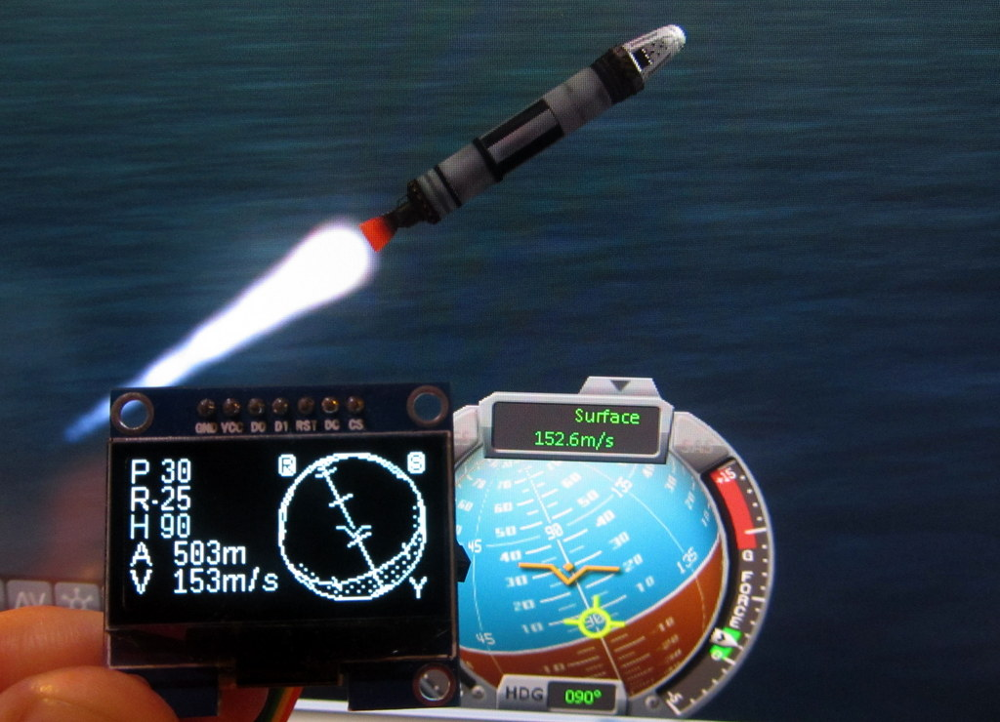

Kerbal Control
==============================

Simple display for [Kerbal Space Program](https://kerbalspaceprogram.com/).
Built on a Chipkit DP32 (Microchip PIC32MX)

Reads data from [KSP SerialIO](http://forum.kerbalspaceprogram.com/threads/66393-Hardware-Plugin-Arduino-based-physical-display-serial-port-io-tutorial-%2808-Oct%29) plugin via serial port.

Displays status and Navball on 128x64px OLED.

[Video here](http://youtu.be/haSRLkled_A)

Uses a tonne of floats in the 3d routine which are probably
over kill considering the resolution of the OLED that we end up rendering to. 	But the PIC had flash/RAM and CPU to spare so why not for now.
Also uses printf to display floats which could probably be avoided

Hardware is a [ChipKit DP32
DP32](https://digilentinc.com/Products/Detail.cfm?NavPath=2,892,1174&Prod=CHIPKIT-DP32)
Display is a 128x64px SH1106 based OLED

Uses [modified Adafruit_GFX](https://github.com/Catmacey/Adafruit_GFX) library and [Catmacey_SH1106](https://github.com/Catmacey/Catmacey_SH1106) library.

Copyright (C) 2014 Matt Casey : catmacey.com

This program is free software: you can redistribute it and/or modify
it under the terms of the GNU General Public License as published by
the Free Software Foundation, either version 3 of the License, or
(at your option) any later version.

This program is distributed in the hope that it will be useful,
but WITHOUT ANY WARRANTY; without even the implied warranty of
MERCHANTABILITY or FITNESS FOR A PARTICULAR PURPOSE.  See the
GNU General Public License for more details.
